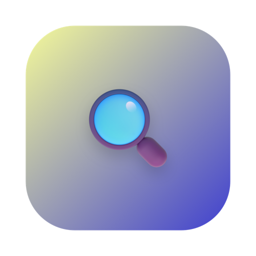

# SwiftLens

A native macOS app — built with Swift / SwiftUI / SPM — for inspecting `.app` bundles. Drop any `.app` onto the window and SwiftLens unpacks its identity, signature, quarantine state, architectures, entitlements, embedded sub-bundles, and dozens of other Info.plist fields in a single, scrollable report.

> 中文版说明请见 [README.zh-CN.md](./README.zh-CN.md).



## Features

- **Drag-and-drop or pick** any `.app` bundle — instant, single-window, no project list.
- **Basic identity** — `CFBundleIdentifier`, `CFBundleShortVersionString` / `CFBundleVersion`, `CFBundleExecutable`, package type, development region, `NSPrincipalClass`, copyright, version variants, supported platforms.
- **Runtime & deployment** — `LSMinimumSystemVersion`, `LSApplicationCategoryType`, high-resolution / graphics switching / safe-area / sudden-termination switches, plus the full build toolchain (`DTSDKName`, `DTPlatformVersion`, `DTXcode`, `BuildMachineOSBuild`, `DTCompiler`).
- **Architectures (Mach-O)** — parses fat / universal headers directly to list every slice (`arm64`, `arm64e`, `x86_64`, `i386`, `ppc`…), with bit width, slice size and fat offset. Top status bar splits universal binaries into independent `Universal · arm64 · x86_64` tags.
- **Document types** — card list of `CFBundleDocumentTypes` (role badge, extensions, UTIs, handler rank, icon file) with an embedded scroll view when the list grows past 6 entries.
- **URL Schemes**, **Exported / Imported UTIs**, **NSServices**.
- **Privacy (TCC usage descriptions)** — every `NS***UsageDescription` key, mapped to a Chinese title and SF Symbol, with a generic fallback for unknown keys.
- **Network security / Electron** — `NSAppTransportSecurity` exception domains, `ElectronAsarIntegrity` hashes.
- **Quarantine** — reads `com.apple.quarantine` via `getxattr`, decodes flags / agent / hex timestamp into a date, and offers a one-click **Remove quarantine** button (manual, ad-hoc / unsigned apps show an orange warning).
- **Extended attributes** — full `listxattr` enumeration; binary values (e.g. `com.apple.macl`) shown as hex.
- **Code signing** — full `codesign -dvvv` parse: state, validity (via `SecStaticCodeCheckValidity`), **notarization** (via `spctl -a -vvv`), `Format`, `Identifier`, `TeamIdentifier`, `CDHash` / `CandidateCDHash` / `CandidateCDHashFull`, hash type / choices, `CMSDigest`, decoded flags (`adhoc`, `runtime`, `library-validation`, `linker-signed`…), `Runtime Version`, sealed resources, internal requirements, Info.plist entries, Authority chain.
- **Entitlements** — parsed key/value list plus the raw XML plist.
- **Embedded sub-bundles** — scans `Frameworks/`, `PlugIns/`, `XPCServices/`, `Helpers/`, `Library/LoginItems/`, including framework-style `Versions/A/Resources/Info.plist` layouts; reports BundleID / version / signature state / Runtime Version per entry.
- **Sparkle auto-update** — `SUFeedURL`, `SUPublicEDKey`, `SUPublicDSAKeyFile`, plus all `SUEnable*` / `SUScheduled*` switches (with seconds ↔ days conversion).
- **AppleScript / Siri / Intents** — `NSAppleScriptEnabled`, `OSAScriptingDefinition`, `NSUserActivityTypes`, `INIntentsSupported`, `SFSafariCorrespondingIOSAppBundleIdentifier`.
- **iCloud** — `NSUbiquitousContainers` expanded per container.
- **Notifications** — `NSUserNotificationAlertStyle` and the three usage-description variants.
- **Misc switches** — sudden / automatic termination, `LSRequiresCarbon`, `LSRequiresNativeExecution`, `LSMultipleInstancesProhibited`, `LSFileQuarantineEnabled`, `GPUEjectPolicy` / `GPUSelectionPolicy`, `ITSAppUsesNonExemptEncryption`.
- **Help / localization / Accent / Spotlight** — `CFBundleHelpBookName` / `Folder`, `CFBundleLocalizations`, `NSAccentColorName`, `MDItemKeywords`.
- **iOS port fields** — `UIDeviceFamily`, `UILaunchStoryboardName`, `UIRequiresFullScreen`, `UISupportedInterfaceOrientations`, `UIStatusBarStyle`, `UIBackgroundModes`, `ASWebAuthenticationSession…`.
- **Electron / build metadata / vendor** — `ElectronTeamID`, `SourceVersion`, `requiredBuildHash`, `SCMRevision`, `AppIdentifierPrefix`, `CFBundleSpokenName`, `VendorCode`, `OrganizationIdentifier`, `CTFontSuppressAutoDownload`.
- **Bonjour** — `NSBonjourServices`.
- **File info** — recursive bundle size, modification / creation dates, octal permissions.
- **Raw `Info.plist`** (full flattened key/value dump) and **raw `codesign -dvvv` output** for debugging.
- **Top status bar** — clickable badges for architectures, isolation, code-signing state, validity, and notarization that jump to the corresponding section.
- **Agent app / background-only / iOS port** detection with dedicated badges.
- **Settings sheet** — language switch (Follow system / 中文 / English) and theme switch (Follow system / Light / Dark), persisted via `@AppStorage`.
- **Hidden CLI mode** — `swift run SwiftLens /path/to.app` prints a full plain-text summary and exits; useful for scripting.

## Requirements

- macOS 12.0+
- Xcode 26.x (for the bundled Xcode project) or just the Swift 5.5+ toolchain (for SPM)

## Build & run

### SPM (no Xcode UI needed)

```sh
swift run SwiftLens                          # launches the GUI
swift run SwiftLens /Applications/Safari.app # CLI summary mode
```

### Xcode project (coexists with SPM)

The repository includes `SwiftLens.xcodeproj`, generated with [xcodegen](https://github.com/yonaskolb/Xcodegen) from `project.yml`. To regenerate after adding or removing source files:

```sh
xcodegen generate
open SwiftLens.xcodeproj
```

Both build paths compile the same sources under `Sources/SwiftLens/`.

## Project layout

```
SwiftLens/
├─ Package.swift                       # SPM manifest
├─ project.yml                         # xcodegen config (Xcode project source of truth)
├─ SwiftLens.xcodeproj/                # generated Xcode project (kept in git)
├─ SwiftLens/
│  ├─ Info.plist
│  ├─ SwiftLens.entitlements
│  └─ Assets.xcassets/
│     └─ AppIcon.appiconset/
└─ Sources/SwiftLens/
   ├─ SwiftLensApp.swift               # @main App + AppDelegate (CLI mode + Dock focus fix)
   ├─ AppState.swift                   # language / theme persistence
   ├─ L10n.swift                       # runtime zh/en string table
   ├─ SettingsView.swift               # settings sheet
   ├─ ContentView.swift                # drag-and-drop shell + loading overlay
   ├─ DetailView.swift                 # all info sections + DocumentTypeRowView + Badge
   ├─ SharedViews.swift                # RowView / SectionView / PlaceholderRow
   ├─ AppInfo.swift                    # aggregated model + loader
   ├─ InfoPlistParser.swift            # Info.plist parse + flatten
   ├─ QuarantineReader.swift           # com.apple.quarantine read / remove
   ├─ ExtendedXattrReader.swift        # full xattr enumeration
   ├─ ArchitectureReader.swift         # Mach-O / fat header parse (arm64e aware)
   ├─ CodeSignReader.swift             # codesign -dvvv + SecStaticCode + spctl
   ├─ SubBundleScanner.swift           # Frameworks / Helpers / XPC / PlugIns scan
   ├─ PrivacyReader.swift              # TCC usage-description catalog
   └─ ExtraInfoReader.swift            # Sparkle / AppleScript / iCloud / Bonjour / ...
```

## License

MIT — see `LICENSE` if present. Source code is provided as-is.

---

中文版说明：[README.zh-CN.md](./README.zh-CN.md)
