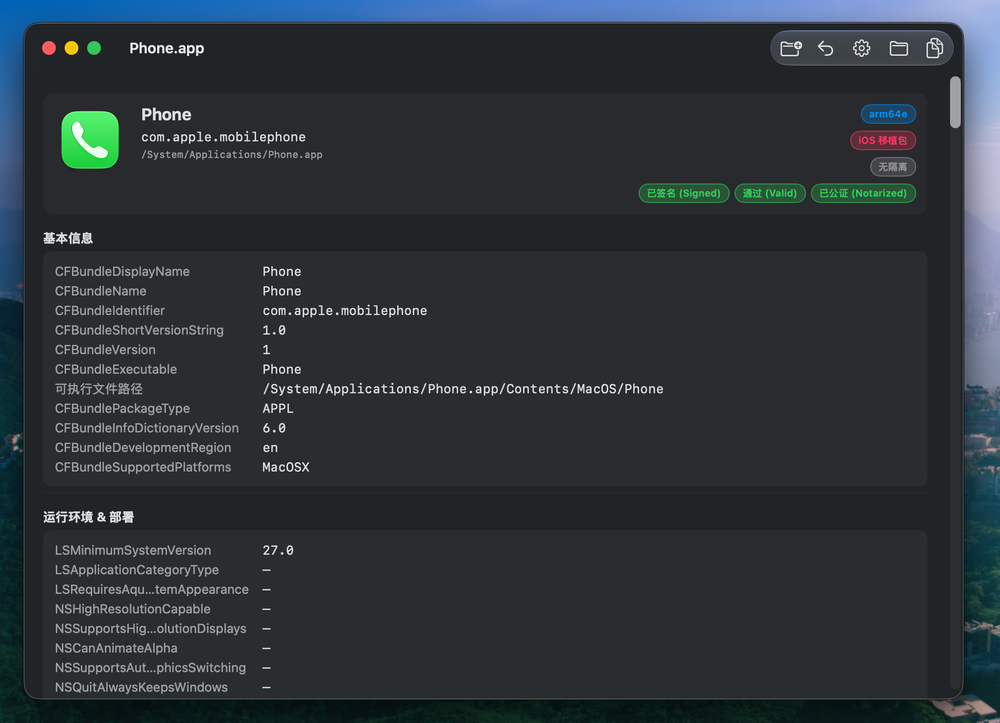

# SwiftLens

> 由 GLM 5.2 / OpenCode Vibe Coding 而成。

一个用 Swift / SwiftUI / SPM 编写的原生 macOS `.app` 信息查看器。把任意 `.app` 拖到窗口里，SwiftLens 会在一个可滚动的报告中一次性展开它的身份、签名、隔离状态、架构、entitlements、内嵌子 bundle 以及数十个其它 Info.plist 字段。

> English version: [README.md](./README.md).



## 功能

- **拖入或选择**任意 `.app` bundle —— 单窗口即用即走，无列表。
- **基本身份** —— `CFBundleIdentifier`、`CFBundleShortVersionString` / `CFBundleVersion`、`CFBundleExecutable`、PackageType、开发语言、`NSPrincipalClass`、版权、版本变体、支持平台。
- **运行环境 & 部署** —— `LSMinimumSystemVersion`、`LSApplicationCategoryType`、高分辨率 / 图形切换 / 安全区 / 突然终止等开关，以及完整构建工具链（`DTSDKName`、`DTPlatformVersion`、`DTXcode`、`BuildMachineOSBuild`、`DTCompiler`）。
- **架构 (Mach-O)** —— 直接解析 fat / universal 头，列出每个切片（`arm64`、`arm64e`、`x86_64`、`i386`、`ppc`…），含位数、切片大小和 fat 偏移。顶部状态栏把通用二进制拆成独立的 `Universal · arm64 · x86_64` tag。
- **文档类型** —— `CFBundleDocumentTypes` 卡片列表（角色 badge、扩展名、UTIs、handler rank、图标文件），超过 6 项时启用内嵌滚动。
- **URL Schemes**、**Exported / Imported UTIs**、**NSServices**。
- **隐私权限描述 (TCC)** —— 所有 `NS***UsageDescription` 键，映射到中文标题 + SF Symbol，未知键有兜底解析。
- **网络安全 / Electron** —— `NSAppTransportSecurity` 例外域、`ElectronAsarIntegrity` 哈希。
- **Quarantine 隔离** —— 通过 `getxattr` 读取 `com.apple.quarantine`，解码 flags / agent / 十六进制时间戳为日期，提供**一键移除隔离**按钮（手动点击；ad-hoc / 未签名应用显示橙色警示）。
- **扩展属性全列表** —— `listxattr` 枚举所有 xattrs；二进制值（如 `com.apple.macl`）以十六进制展示。
- **代码签名** —— 完整 `codesign -dvvv` 解析：状态、有效性（`SecStaticCodeCheckValidity`）、**公证**（`spctl -a -vvv`）、`Format`、`Identifier`、`TeamIdentifier`、`CDHash` / `CandidateCDHash` / `CandidateCDHashFull`、哈希类型 / choices、`CMSDigest`、解码后的 flags（`adhoc`、`runtime`、`library-validation`、`linker-signed`…）、`Runtime Version`、sealed resources、internal requirements、Info.plist entries、Authority 链。
- **Entitlements** —— 解析后的键值列表 + 原始 XML plist。
- **内嵌子 bundle** —— 扫描 `Frameworks/`、`PlugIns/`、`XPCServices/`、`Helpers/`、`Library/LoginItems/`，支持 framework 的 `Versions/A/Resources/Info.plist` 布局；每个条目报告 BundleID / 版本 / 签名状态 / Runtime Version。
- **Sparkle 自动更新** —— `SUFeedURL`、`SUPublicEDKey`、`SUPublicDSAKeyFile`，以及所有 `SUEnable*` / `SUScheduled*` 开关（秒 ↔ 天自动换算）。
- **AppleScript / Siri / Intents** —— `NSAppleScriptEnabled`、`OSAScriptingDefinition`、`NSUserActivityTypes`、`INIntentsSupported`、`SFSafariCorrespondingIOSAppBundleIdentifier`。
- **iCloud** —— `NSUbiquitousContainers` 按容器完整展开。
- **通知** —— `NSUserNotificationAlertStyle` 与三种 UsageDescription。
- **杂项开关** —— 突然 / 自动终止、`LSRequiresCarbon`、`LSRequiresNativeExecution`、`LSMultipleInstancesProhibited`、`LSFileQuarantineEnabled`、`GPUEjectPolicy` / `GPUSelectionPolicy`、`ITSAppUsesNonExemptEncryption`。
- **帮助 / 本地化 / Accent / Spotlight** —— `CFBundleHelpBookName` / `Folder`、`CFBundleLocalizations`、`NSAccentColorName`、`MDItemKeywords`。
- **iOS 移植包字段** —— `UIDeviceFamily`、`UILaunchStoryboardName`、`UIRequiresFullScreen`、`UISupportedInterfaceOrientations`、`UIStatusBarStyle`、`UIBackgroundModes`、`ASWebAuthenticationSession…`。
- **Electron / 构建元数据 / 厂商** —— `ElectronTeamID`、`SourceVersion`、`requiredBuildHash`、`SCMRevision`、`AppIdentifierPrefix`、`CFBundleSpokenName`、`VendorCode`、`OrganizationIdentifier`、`CTFontSuppressAutoDownload`。
- **Bonjour** —— `NSBonjourServices`。
- **文件信息** —— 递归 bundle 体积、修改 / 创建时间、八进制权限。
- **原始 `Info.plist`**（扁平化全键值）与 **原始 `codesign -dvvv` 输出**，便于调试。
- **顶部状态栏** —— 架构 / 隔离 / 签名状态 / 有效性 / 公证徽标可点击，跳转到对应分区。
- **Agent App / 仅后台 / iOS 移植包** 自动识别并显示徽标。
- **设置面板** —— 语言切换（跟随系统 / 中文 / English）与主题切换（跟随系统 / 浅色 / 深色），通过 `@AppStorage` 持久化。
- **隐藏 CLI 模式** —— `swift run SwiftLens /path/to.app` 打印完整纯文本摘要并退出，便于脚本化。

## 环境要求

- macOS 12.0+
- Xcode 26.x（用于附带的 Xcode 项目），或仅需 Swift 5.5+ 工具链（用于 SPM）

## 构建与运行

### SPM（无需打开 Xcode）

```sh
swift run SwiftLens                            # 启动 GUI
swift run SwiftLens /Applications/Safari.app   # CLI 摘要模式
```

### Xcode 项目（与 SPM 共存）

仓库包含 `SwiftLens.xcodeproj`，由 [xcodegen](https://github.com/yonaskolb/Xcodegen) 从 `project.yml` 生成。新增 / 移除源文件后重新生成：

```sh
xcodegen generate
open SwiftLens.xcodeproj
```

两种构建路径都编译同一份 `Sources/SwiftLens/` 源码。

## 项目结构

```
SwiftLens/
├─ Package.swift                       # SPM 清单
├─ project.yml                         # xcodegen 配置 (Xcode 项目的真相来源)
├─ SwiftLens.xcodeproj/                # 生成的 Xcode 项目 (入库)
├─ SwiftLens/
│  ├─ Info.plist
│  ├─ SwiftLens.entitlements
│  └─ Assets.xcassets/
│     └─ AppIcon.appiconset/
└─ Sources/SwiftLens/
   ├─ SwiftLensApp.swift               # @main App + AppDelegate (CLI 模式 + Dock 焦点修复)
   ├─ AppState.swift                   # 语言 / 主题持久化
   ├─ L10n.swift                       # 运行时 zh/en 字符串表
   ├─ SettingsView.swift               # 设置 sheet
   ├─ ContentView.swift                # 拖放壳 + 加载遮罩
   ├─ DetailView.swift                 # 所有信息分区 + DocumentTypeRowView + Badge
   ├─ SharedViews.swift                # RowView / SectionView / PlaceholderRow
   ├─ AppInfo.swift                    # 聚合模型 + loader
   ├─ InfoPlistParser.swift            # Info.plist 解析 + 扁平化
   ├─ QuarantineReader.swift           # com.apple.quarantine 读取 / 移除
   ├─ ExtendedXattrReader.swift        # 全 xattr 枚举
   ├─ ArchitectureReader.swift         # Mach-O / fat 头解析 (识别 arm64e)
   ├─ CodeSignReader.swift             # codesign -dvvv + SecStaticCode + spctl
   ├─ SubBundleScanner.swift           # Frameworks / Helpers / XPC / PlugIns 扫描
   ├─ PrivacyReader.swift              # TCC 权限描述目录
   └─ ExtraInfoReader.swift            # Sparkle / AppleScript / iCloud / Bonjour / ...
```

## 许可

MIT —— 如存在 `LICENSE` 文件则以其为准。源码按 "as-is" 提供。

---

English version: [README.md](./README.md)
